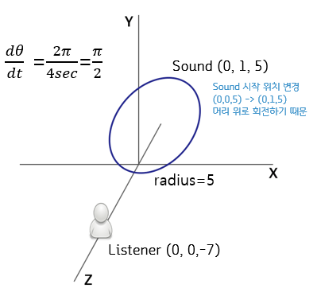

# Digital Sound module 1

## Introduction 
This project is a module #1 for Digital Sound Lecture  

### Learning Objective
Implement sound-manipulating effect through stereo speaker  

### Content
#### Topic
Implement 3D Aural Effect by moving the sound source back and forth  
#### Principle & Theory
Used difference between intensity of the sound and left and right balance, based on psychoacoustic  

### Problem 
Stereo speakers are the only sound effects of moving objects that generate sound above the user's head in a circular motion    
  1. Prepare 1 second-length .wav audio sample (16000Hz, 16-bit, stereo)
  2. Program has to read the prepared 4 second-length audio sample as an input
  3. Save the audio sample as the following effect above.

---

## Solution
Input: 1 second mono frequency sound (16000Hz, 16-bit, stereo), '''file source & exe must be in the same directory'''
Output: 4 second-length result audio sample with 3D aural effect hovering above in circular motion  

  
To summarize, I simply utilized angular velocity considering the length of the sound  

---

## Library 

Used FMOD Library to manipulate sound source as an object.  
For more information about FMOD, visit [FMOD User Manual](https://www.fmod.com/resources/documentation-api?version=2.0&page=welcome.html)

